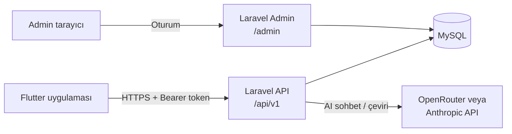

<div align="center">

# LinguaAI — Yapay Zekâ Destekli Dil Öğrenme Uygulaması

Kısa günlük derslerle kelime, dinleme ve konuşma pratiği; AI konuşma asistanı ve anlık çeviri.

**Flutter** mobil uygulama · **Laravel 12** REST API + admin panel · **MySQL**

</div>

<p align="center">
  
  
  
  
</p>

## Özellikler

### Mobil uygulama

| Ekran | Neler var |
| --- | --- |
| **Ana Sayfa** | Günlük hedef halkası, 7 günlük seri takibi, çalışma süresi ve ders metrikleri, kaldığın ders, günün kelimesi ve ipucu |
| **Ders / Quiz** | Süre sayacı, ilerleme çubuğu, sesli dinleme (TTS), anlık geri bildirim ve XP. 6 alıştırma tipi: çoktan seçmeli, görselden seçim, boşluk doldurma, dinle-yaz, cümle kurma, eşleştirme |
| **Pratik** | Ünite ve ders yolu (kilitli / açık / tamamlanmış), kurs değiştirme |
| **AI Konuşma Asistanı** | Sesli konuşma (konuşma tanıma), senaryolu sohbet (restoran, seyahat, iş görüşmesi…), anlık çeviri, doğruluk/akıcılık analizi |
| **Anlık Çeviri** | Dil değiştirme, sesli giriş, telaffuz dinleme, favoriler, çeviri geçmişi, hızlı kalıplar, günün deyimi |
| **Kelime Defteri** | Öğrenilen kelimeler, favoriler, aralıklı tekrar (spaced repetition) kartları |
| **Profil** | XP, seri, 7 günlük grafik, rozetler, günlük hedef ve hesap ayarları |

### Admin panel

- Dashboard: kullanıcı, aktiflik ve tamamlanan ders istatistikleri, 30 günlük grafik
- **Kurs → Ünite → Ders → Alıştırma** yönetimi, sürükle-bırak sıralama
- Alıştırma editörü: tipe göre değişen form, ses/görsel yükleme, doğrulama
- Kelime bankası (CSV ile toplu içe aktarma), kalıplar ve deyimler, AI senaryoları, günün ipuçları
- Kullanıcı yönetimi (ilerleme detayı, hesap dondurma), rol bazlı admin yönetimi
- **Yapay Zekâ Ayarları:** OpenRouter veya Anthropic (Claude) seçimi, API anahtarı ve model doğrudan panelden girilir (anahtarlar şifreli saklanır), canlı model listesi ve bağlantı testi

## Mimari



| Katman | Teknoloji |
| --- | --- |
| Mobil | Flutter 3, Riverpod, Dio, go_router, flutter_secure_storage, flutter_tts, speech_to_text |
| Backend | Laravel 12, PHP 8.2+, Sanctum (token), Blade + Tailwind CSS 4 |
| Veritabanı | MySQL 8 / MariaDB |
| Yapay zekâ | OpenRouter (yüzlerce model) veya Anthropic Claude — admin panelden seçilir |

```
.
├── backend/            # Laravel: API (routes/api.php) + admin panel (routes/web.php)
├── mobile/             # Flutter uygulaması (lib/core, lib/features/*)
├── ekrantasarimları/   # HTML ekran tasarımları ve tasarım sistemi (DESIGN.md)
└── docs/screenshots/
```

## Kurulum

Gereksinimler: PHP 8.2+, Composer, Node.js 20+, MySQL/MariaDB (ör. XAMPP), Flutter 3.x, Android SDK.

### 1. Backend ve admin panel

```bash
cd backend
composer install
npm install && npm run build
cp .env.example .env
php artisan key:generate
```

`.env` içindeki veritabanı ayarlarını düzenleyin (varsayılan: `dil_ogrenme`, kullanıcı `root`), veritabanını oluşturun ve çalıştırın:

```bash
php artisan migrate --seed
php artisan storage:link
php artisan serve --port=8000
```

| | Adres | Giriş |
| --- | --- | --- |
| Admin panel | http://localhost:8000/admin | `admin@linguaai.test` / `password` |
| Mobil demo kullanıcı | — | `selin@linguaai.test` / `password` |

> Demo hesaplar yalnızca yerel geliştirme içindir; canlı ortamda şifreleri değiştirin.

### 2. Yapay zekâ (isteğe bağlı)

Admin panelde **Yapay Zekâ Ayarları** sayfasından sağlayıcıyı seçin, API anahtarını ve modeli girip **Bağlantıyı Test Et**'e basın.

- **OpenRouter:** [openrouter.ai/keys](https://openrouter.ai/keys) adresinden anahtar alın; model listesi panelde otomatik gelir (JSON çıktı destekleyen bir model seçin).
- **Anthropic:** Claude API anahtarı; varsayılan model `claude-opus-5`.

Anahtar girilmezse uygulama **çevrimdışı modda** çalışır: çeviri kelime bankası ve kalıplardan, sohbet senaryo tabanlı hazır yanıtlardan beslenir.

### 3. Mobil uygulama

```bash
cd mobile
flutter pub get
flutter run --dart-define=API_URL=http://10.0.2.2:8000/api/v1   # Android emülatör
```

**Fiziksel Android cihazda** telefonun bilgisayardaki API'ye ulaşması için:

```bash
adb reverse tcp:8000 tcp:8000
flutter run --dart-define=API_URL=http://127.0.0.1:8000/api/v1
```

<details>
<summary><b>Windows: proje yolunda Türkçe karakter varsa</b></summary>

Android araçları (Gradle, aapt) ve Dart analiz sunucusu `ö, ü, ş` gibi karakterler içeren yollarda hata verir. Proje klasörünü ASCII bir sürücü harfine bağlayıp oradan çalıştırın:

```bash
subst L: "C:\Projeler\egitim\bölüm2"
cd /d L:\mobile && flutter run --dart-define=API_URL=http://127.0.0.1:8000/api/v1
```

`mobile/android/gradle.properties` içinde bu durum için `android.overridePathCheck=true` ve `kotlin.incremental=false` ayarları hazırdır.
</details>

## API

Tüm uç noktalar `/api/v1` altındadır ve standart yanıt döner:

```json
{ "success": true, "message": "İşlem başarılı", "data": { } }
```

| Metot | Yol | Açıklama |
| --- | --- | --- |
| POST | `/auth/register`, `/auth/login`, `/auth/logout` | Kimlik doğrulama (Sanctum token) |
| GET / PUT / DELETE | `/me` | Profil |
| GET | `/home` | Ana sayfa verisi (hedef, seri, metrikler, güncel ders) |
| GET | `/courses`, `/courses/{id}/path` | Kurslar ve öğrenme yolu |
| POST | `/courses/{id}/enroll` | Kursa başla |
| GET / POST | `/lessons/{id}`, `/lessons/{id}/complete` | Ders ve sonuç (XP sunucuda hesaplanır) |
| GET / POST | `/words`, `/words/{id}/review`, `/words/{id}/favorite` | Kelime defteri ve tekrar |
| GET | `/stats` | XP geçmişi, rozetler |
| GET / POST | `/translate/home`, `/translate`, `/translate/history` | Çeviri |
| GET / POST / DELETE | `/chat/scenarios`, `/chat/messages` | AI sohbet |
