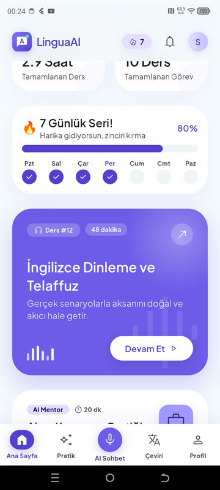
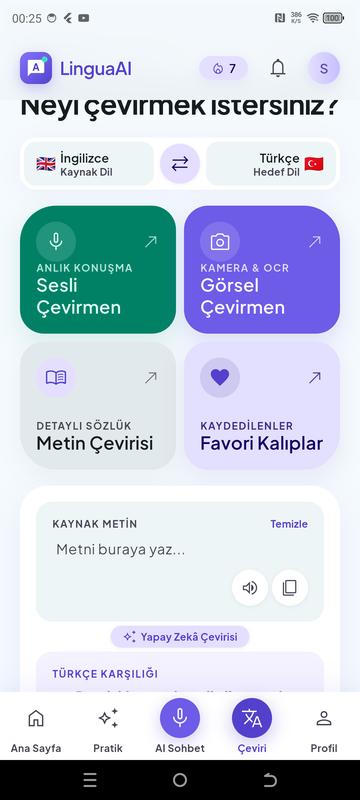
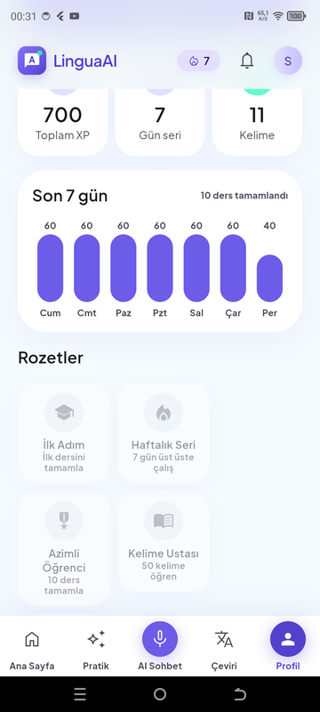
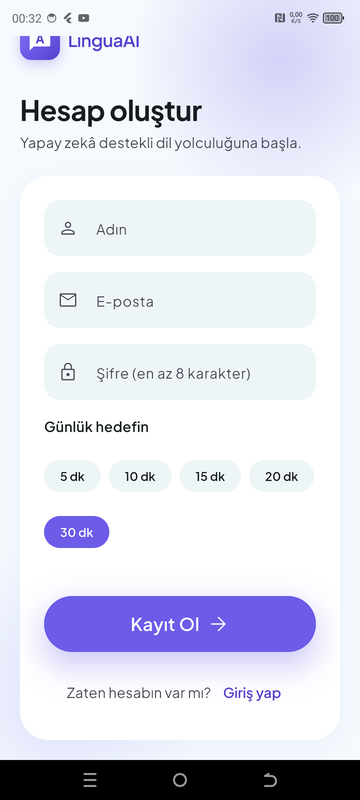
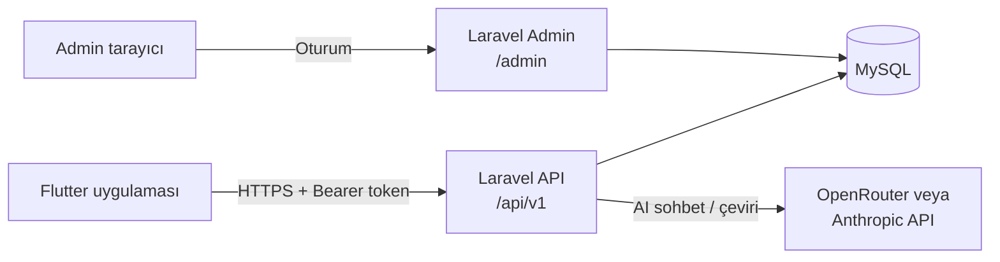

<div align="center">

# LinguaAI — Yapay Zekâ Destekli Dil Öğrenme Uygulaması

Kısa günlük derslerle kelime, dinleme ve konuşma pratiği; AI konuşma asistanı ve anlık çeviri.

**Flutter** mobil uygulama · **Laravel 12** REST API + admin panel · **MySQL**

</div>

<p align="center">
  
  
  
  
</p>

## ⚠️ Yayına Almadan Önce Yapılması Gerekenler

> [!IMPORTANT]
> Uygulama şu an **geliştirme durumundadır**. Google Play / App Store'a yüklemeden önce aşağıdaki maddeler mutlaka tamamlanmalıdır.

### 1. Paket isimlerini güncelle (zorunlu)

Şu an geçici paket adları kullanılıyor. Mağazaya bir kez yüklendikten sonra **paket adı değiştirilemez**, bu yüzden ilk yüklemeden önce kalıcı adı belirleyin (ör. `com.sirketadi.linguaai`).

| Platform | Dosya | Mevcut değer |
| --- | --- | --- |
| Android | `mobile/android/app/build.gradle.kts` → `namespace`, `applicationId` | `com.linguaai.lingua_ai` |
| Android | `mobile/android/app/src/main/kotlin/...` → `MainActivity.kt` klasör yolu ve `package` satırı | `com/linguaai/lingua_ai` |
| iOS | `mobile/ios/Runner.xcodeproj/project.pbxproj` → `PRODUCT_BUNDLE_IDENTIFIER` | `com.linguaai.linguaAi` |
| iOS | `mobile/ios/Runner/Info.plist` → `CFBundleDisplayName` | `Lingua Ai` → `LinguaAI` |

> [!TIP]
> [`change_app_package_name`](https://pub.dev/packages/change_app_package_name) paketi Android ve iOS'u tek komutla günceller.

### 2. Keystore ile imzalama (zorunlu)

Release derlemesi şu an **debug anahtarıyla** imzalanıyor (`build.gradle.kts` → `signingConfig = signingConfigs.getByName("debug")`); Google Play bunu kabul etmez.

1. Yükleme anahtarı oluşturun:
   ```bash
   keytool -genkey -v -keystore upload-keystore.jks -keyalg RSA -keysize 2048 -validity 10000 -alias upload
   ```
2. `mobile/android/key.properties` dosyasına `storePassword`, `keyPassword`, `keyAlias`, `storeFile` yazın.
3. `build.gradle.kts` içinde `signingConfigs { create("release") { ... } }` tanımlayıp `release` derlemesini ona bağlayın.

> [!CAUTION]
> `*.jks`, `*.keystore` ve `key.properties` dosyaları `.gitignore` içindedir; **asla GitHub'a yüklemeyin** ve güvenli bir yerde yedekleyin. Anahtar kaybolursa uygulamayı güncelleyemezsiniz.

### 3. Logo ve uygulama ikonu (zorunlu)

Uygulama ikonu şu an **varsayılan Flutter logosu**. Uygulama içindeki logo (`lib/core/widgets/app_logo.dart`) kodla çizilmiştir.

- 1024×1024 PNG logo hazırlayıp `mobile/assets/icon/` altına koyun.
- [`flutter_launcher_icons`](https://pub.dev/packages/flutter_launcher_icons) ile Android (adaptive icon dahil) ve iOS ikonlarını üretin.
- Açılış ekranı (splash) için [`flutter_native_splash`](https://pub.dev/packages/flutter_native_splash) ekleyin.
- Admin paneldeki logo (`resources/views/components/admin-layout.blade.php`) ve favicon da güncellenmelidir.

### 4. AdMob reklam entegrasyonu (gelir modeli)

Ücretsiz kullanıcılara reklam gösterilerek gelir elde edilebilir.

- [`google_mobile_ads`](https://pub.dev/packages/google_mobile_ads) paketini ekleyin.
- AdMob **App ID**'sini `AndroidManifest.xml` (`com.google.android.gms.ads.APPLICATION_ID`) ve `Info.plist` (`GADApplicationIdentifier`) içine yazın.
- Önerilen yerleşim: ders sonucu ekranında **geçiş reklamı (interstitial)**, ek XP/can için **ödüllü reklam (rewarded)**, ana sayfanın altında **banner**.
- Premium kullanıcılara reklam gösterilmemelidir (bkz. madde 5).
- Test sırasında mutlaka **test reklam ID'leri** kullanın; kendi reklamlarınıza tıklamak hesabın kapatılmasına yol açar.
- GDPR/KVKK için kullanıcı onayı (UMP SDK) eklenmelidir.

### 5. Premium üyelik (gelir modeli)

Aylık/yıllık abonelikle reklamsız ve sınırsız kullanım sunulabilir.

- Mağaza içi satın alma: [`in_app_purchase`](https://pub.dev/packages/in_app_purchase) veya abonelik yönetimini kolaylaştıran [RevenueCat](https://www.revenuecat.com/) (`purchases_flutter`).
- **Backend:** `users` tablosuna `is_premium` / `premium_until` alanları, satın alma makbuzunu sunucuda doğrulayan bir uç nokta (`POST /api/v1/subscriptions/verify`) ve mağaza bildirimleri için webhook.
- **Admin panel:** kullanıcı detayında premium durumu, abonelik geçmişi ve gelir istatistikleri.
- Premium'a özel özellik önerileri: reklamsız kullanım, sınırsız AI sohbet (ücretsizde günlük mesaj limiti), tüm kurslara erişim, çevrimdışı ders indirme, ayrıntılı telaffuz analizi.

### Diğer yayın kontrolleri

- [ ] `backend/.env` → `APP_ENV=production`, `APP_DEBUG=false`, HTTPS `APP_URL`
- [ ] Demo hesapların (`admin@linguaai.test`, `selin@linguaai.test`) şifrelerini değiştirin veya silin
- [ ] Mobilde `API_URL` canlı HTTPS adresine ayarlanmalı; `AndroidManifest.xml` içindeki `usesCleartextTraffic="true"` kaldırılmalı
- [ ] Gizlilik politikası ve kullanım koşulları sayfaları (mağazalar için zorunlu, mikrofon izni gerekçesi dahil)

## Özellikler

### Mobil uygulama

| Ekran | Neler var |
| --- | --- |
| **Ana Sayfa** | Günlük hedef halkası, 7 günlük seri takibi, çalışma süresi ve ders metrikleri, kaldığın ders, günün kelimesi ve ipucu |
| **Ders / Quiz** | Süre sayacı, ilerleme çubuğu, sesli dinleme (TTS), anlık geri bildirim ve XP. 6 alıştırma tipi: çoktan seçmeli, görselden seçim, boşluk doldurma, dinle-yaz, cümle kurma, eşleştirme |
| **Pratik** | Ünite ve ders yolu (kilitli / açık / tamamlanmış), kurs değiştirme |
| **AI Konuşma Asistanı** | Sesli konuşma (konuşma tanıma), senaryolu sohbet (restoran, seyahat, iş görüşmesi…), anlık çeviri, doğruluk/akıcılık analizi |
| **Anlık Çeviri** | Dil değiştirme, sesli giriş, telaffuz dinleme, favoriler, çeviri geçmişi, hızlı kalıplar, günün deyimi |
| **Kelime Defteri** | Öğrenilen kelimeler, favoriler, aralıklı tekrar (spaced repetition) kartları |
| **Profil** | XP, seri, 7 günlük grafik, rozetler, günlük hedef ve hesap ayarları |

### Admin panel

- Dashboard: kullanıcı, aktiflik ve tamamlanan ders istatistikleri, 30 günlük grafik
- **Kurs → Ünite → Ders → Alıştırma** yönetimi, sürükle-bırak sıralama
- Alıştırma editörü: tipe göre değişen form, ses/görsel yükleme, doğrulama
- Kelime bankası (CSV ile toplu içe aktarma), kalıplar ve deyimler, AI senaryoları, günün ipuçları
- Kullanıcı yönetimi (ilerleme detayı, hesap dondurma), rol bazlı admin yönetimi
- **Yapay Zekâ Ayarları:** OpenRouter veya Anthropic (Claude) seçimi, API anahtarı ve model doğrudan panelden girilir (anahtarlar şifreli saklanır), canlı model listesi ve bağlantı testi

## Mimari



| Katman | Teknoloji |
| --- | --- |
| Mobil | Flutter 3, Riverpod, Dio, go_router, flutter_secure_storage, flutter_tts, speech_to_text |
| Backend | Laravel 12, PHP 8.2+, Sanctum (token), Blade + Tailwind CSS 4 |
| Veritabanı | MySQL 8 / MariaDB |
| Yapay zekâ | OpenRouter (yüzlerce model) veya Anthropic Claude — admin panelden seçilir |

```
.
├── backend/            # Laravel: API (routes/api.php) + admin panel (routes/web.php)
├── mobile/             # Flutter uygulaması (lib/core, lib/features/*)
├── ekrantasarimları/   # HTML ekran tasarımları ve tasarım sistemi (DESIGN.md)
└── docs/screenshots/
```

## Kurulum

Gereksinimler: PHP 8.2+, Composer, Node.js 20+, MySQL/MariaDB (ör. XAMPP), Flutter 3.x, Android SDK.

### 1. Backend ve admin panel

```bash
cd backend
composer install
npm install && npm run build
cp .env.example .env
php artisan key:generate
```

`.env` içindeki veritabanı ayarlarını düzenleyin (varsayılan: `dil_ogrenme`, kullanıcı `root`), veritabanını oluşturun ve çalıştırın:

```bash
php artisan migrate --seed
php artisan storage:link
php artisan serve --port=8000
```

| | Adres | Giriş |
| --- | --- | --- |
| Admin panel | http://localhost:8000/admin | `admin@linguaai.test` / `password` |
| Mobil demo kullanıcı | — | `selin@linguaai.test` / `password` |

> Demo hesaplar yalnızca yerel geliştirme içindir; canlı ortamda şifreleri değiştirin.

### 2. Yapay zekâ (isteğe bağlı)

Admin panelde **Yapay Zekâ Ayarları** sayfasından sağlayıcıyı seçin, API anahtarını ve modeli girip **Bağlantıyı Test Et**'e basın.

- **OpenRouter:** [openrouter.ai/keys](https://openrouter.ai/keys) adresinden anahtar alın; model listesi panelde otomatik gelir (JSON çıktı destekleyen bir model seçin).
- **Anthropic:** Claude API anahtarı; varsayılan model `claude-opus-5`.

Anahtar girilmezse uygulama **çevrimdışı modda** çalışır: çeviri kelime bankası ve kalıplardan, sohbet senaryo tabanlı hazır yanıtlardan beslenir.

### 3. Mobil uygulama

```bash
cd mobile
flutter pub get
flutter run --dart-define=API_URL=http://10.0.2.2:8000/api/v1   # Android emülatör
```

**Fiziksel Android cihazda** telefonun bilgisayardaki API'ye ulaşması için:

```bash
adb reverse tcp:8000 tcp:8000
flutter run --dart-define=API_URL=http://127.0.0.1:8000/api/v1
```

<details>
<summary><b>Windows: proje yolunda Türkçe karakter varsa</b></summary>

Android araçları (Gradle, aapt) ve Dart analiz sunucusu `ö, ü, ş` gibi karakterler içeren yollarda hata verir. Proje klasörünü ASCII bir sürücü harfine bağlayıp oradan çalıştırın:

```bash
subst L: "C:\Projeler\egitim\bölüm2"
cd /d L:\mobile && flutter run --dart-define=API_URL=http://127.0.0.1:8000/api/v1
```

`mobile/android/gradle.properties` içinde bu durum için `android.overridePathCheck=true` ve `kotlin.incremental=false` ayarları hazırdır.
</details>

## API

Tüm uç noktalar `/api/v1` altındadır ve standart yanıt döner:

```json
{ "success": true, "message": "İşlem başarılı", "data": { } }
```

| Metot | Yol | Açıklama |
| --- | --- | --- |
| POST | `/auth/register`, `/auth/login`, `/auth/logout` | Kimlik doğrulama (Sanctum token) |
| GET / PUT / DELETE | `/me` | Profil |
| GET | `/home` | Ana sayfa verisi (hedef, seri, metrikler, güncel ders) |
| GET | `/courses`, `/courses/{id}/path` | Kurslar ve öğrenme yolu |
| POST | `/courses/{id}/enroll` | Kursa başla |
| GET / POST | `/lessons/{id}`, `/lessons/{id}/complete` | Ders ve sonuç (XP sunucuda hesaplanır) |
| GET / POST | `/words`, `/words/{id}/review`, `/words/{id}/favorite` | Kelime defteri ve tekrar |
| GET | `/stats` | XP geçmişi, rozetler |
| GET / POST | `/translate/home`, `/translate`, `/translate/history` | Çeviri |
| GET / POST / DELETE | `/chat/scenarios`, `/chat/messages` | AI sohbet |
